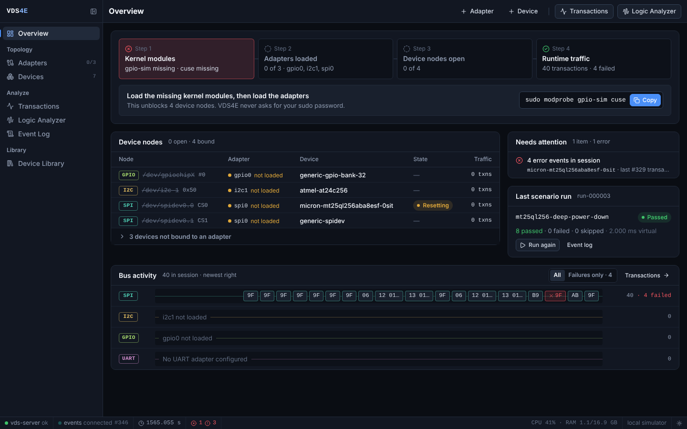
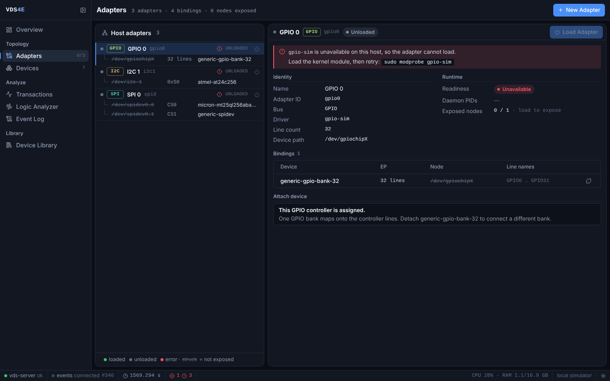
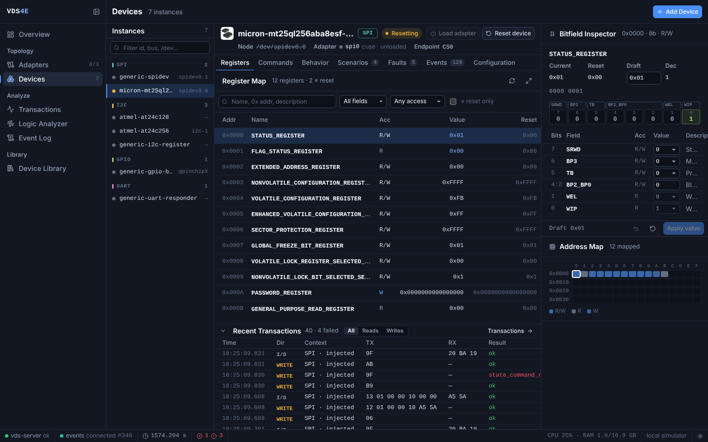
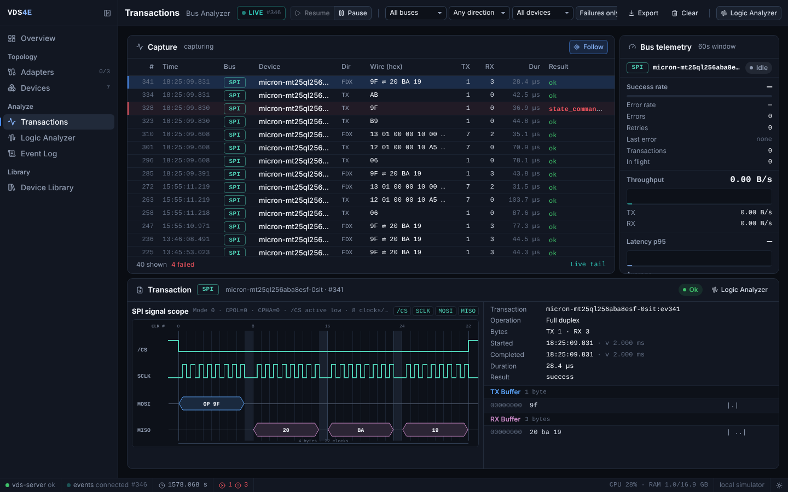
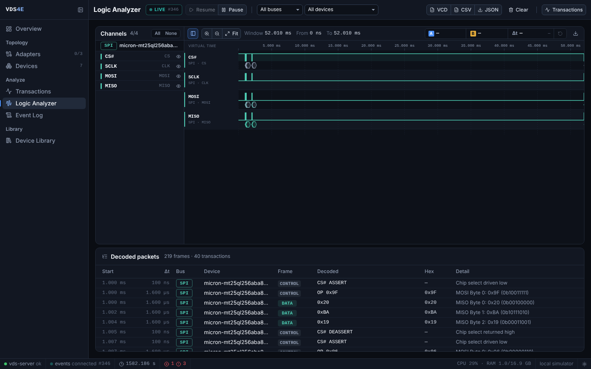
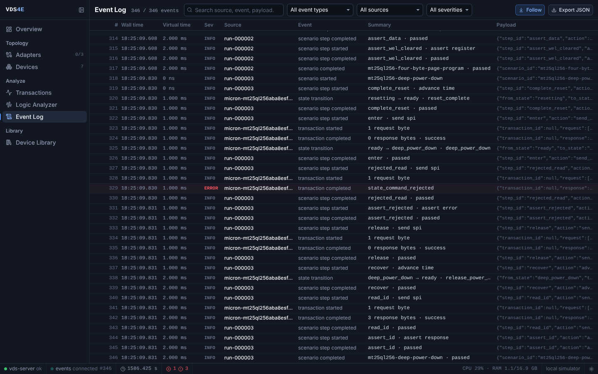
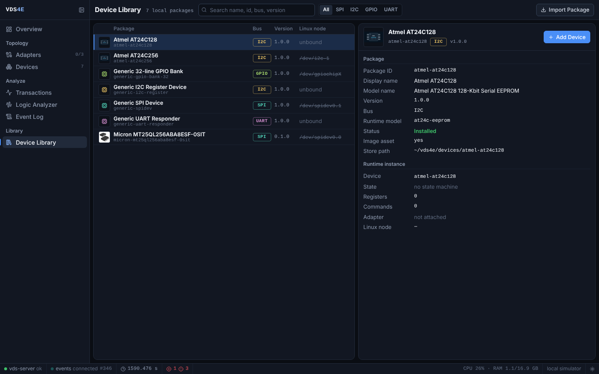
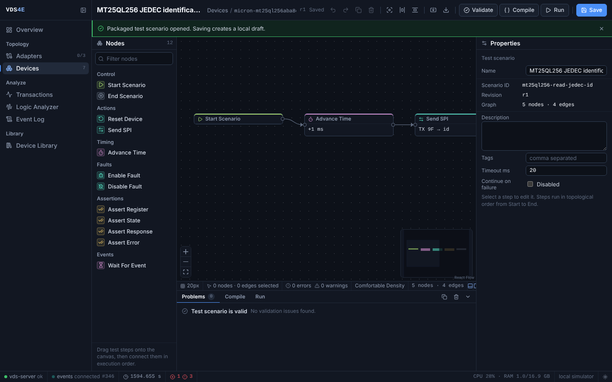

# Virtual Device Simulator for Embedded (VDS4E)

[](https://github.com/haknkayaa/VirtualDeviceSimulatorForEmbedded/actions/workflows/ci.yml)
[](https://github.com/haknkayaa/VirtualDeviceSimulatorForEmbedded/actions/workflows/release.yml)

**Run Embedded Linux applications against virtual SPI, I²C, GPIO and UART devices without the physical target board.**

VDS4E is a hardwareless integration-testing environment for Embedded Linux software. It exposes virtual peripherals through normal Linux userspace interfaces such as `/dev/spidevX.Y`, `/dev/i2c-N`, `/dev/gpiochipN` and PTYs, allowing native x86_64 builds of production applications and standard Linux tools to exercise stateful device models on a development workstation.

VDS4E is not a CPU or board emulator. It focuses on the boundary between an Embedded Linux application and the device interfaces it already uses.

## See VDS4E

[Website](https://vds4e.dev) · [Product film (2:30)](https://vds4e.dev/#product-film) · [Download a release](https://github.com/haknkayaa/VirtualDeviceSimulatorForEmbedded/releases)

[](https://vds4e.dev/#product-film)

Actual application captures with bundled example models. The captured session shows missing host-kernel prerequisites and deliberately rejected commands; these diagnostics are part of the workflow.

<details>
<summary>Explore the application screenshots</summary>

### Host adapters

Linux-facing bindings and host prerequisites.



### Registers and bit fields

Micron SPI flash state, access rules, reset values, and bit fields.



### Transaction analyzer

Requests, responses, errors, and decoded SPI signals.



### Logic analyzer

Virtual signal channels and decoded packets.



### Scenario event log

Scenario steps and device state transitions.



### Device library

Installed example model packages.



### Visual scenario editor

JEDEC-ID scenario with virtual time, SPI operations, and assertions.



</details>

## Why VDS4E?

Traditional mocks often replace application code paths. Full-system emulators model much more of the machine than many application-level tests need. VDS4E sits between those approaches:

- **No VDS-specific API in the application.** Production code continues to use the Linux device ABI.
- **Kernel-visible interfaces.** SPI, I²C and GPIO can be exercised through normal device nodes; UART uses a standard PTY.
- **Stateful peripherals.** Device packages can model registers, bitfields, memory, state machines, timed operations, faults and reset behavior.
- **Declarative models.** Peripheral behavior lives in versioned device packages rather than application-side test doubles.
- **Cross-device topology.** Public device signals can drive GPIO lines, enabling flows such as sensor DRDY → GPIO edge → bus read.
- **Observable execution.** Transactions, registers, state, faults, scenarios and telemetry are available through the control plane.
- **Automation friendly.** Headless scenarios can produce JSON and JUnit results for integration and CI workflows.

## Architecture

```text
┌──────────────────────────────────────────────────────────────────────┐
│ Embedded Linux application / standard Linux tool                    │
│ spidev_test · i2c-tools · libgpiod tools · normal application code  │
└───────────────────────────────┬──────────────────────────────────────┘
                                │ normal Linux userspace ABI
                                ▼
┌──────────────────────────────────────────────────────────────────────┐
│ VDS4E host adapters                                                  │
│ SPI CUSE · I²C CUSE · gpio-sim · UART PTY                           │
└───────────────────────────────┬──────────────────────────────────────┘
                                │ framed Protobuf / Unix socket
                                ▼
┌──────────────────────────────────────────────────────────────────────┐
│ VDS4E runtime                                                        │
│ device registry · registers · behavior · virtual time · topology     │
└───────────────────────────────┬──────────────────────────────────────┘
                                │
                                ▼
┌──────────────────────────────────────────────────────────────────────┐
│ Declarative device packages                                         │
│ model · flows · scenarios · fixtures · docs · assets                 │
└──────────────────────────────────────────────────────────────────────┘

Control & observability: REST API · WebSocket events · React Web UI
```

The detailed design and architectural boundaries are documented in [VDS4E_ARCHITECTURE.md](VDS4E_ARCHITECTURE.md).

## Supported interfaces

| Interface | Linux-facing endpoint | Runtime support | Typical clients |
| --- | --- | --- | --- |
| SPI / spidev | `/dev/spidevX.Y` via CUSE | `generic-spi-command` | production spidev applications, upstream `spidev_test` |
| I²C / i2c-dev | `/dev/i2c-N` via CUSE | `generic-i2c-register`, AT24C EEPROM | `i2cdetect`, `i2cget`, `i2cset`, `i2ctransfer`, libi2c applications |
| GPIO | real `/dev/gpiochipN` via kernel `gpio-sim` | `generic-gpio-bank` | `gpiodetect`, `gpioinfo`, `gpioget`, `gpioset`, `gpiomon`, libgpiod applications |
| UART / TTY | kernel-assigned `/dev/pts/N` | `generic-uart-responder` | applications using `open/read/write` and termios |
| QSPI multi-lane / DTR | native VDS4E transaction path | SPI wire-setting validation | VDS4E native clients |
| Ethernet / CAN / USB | — | not implemented | — |

SPI and I²C CUSE adapters and the GPIO `gpio-sim` integration require appropriate host-kernel support and privileges. UART PTY operation is unprivileged.

## Quick start

### Install a release package

Tagged releases publish an `amd64` Debian package and SHA-256 checksum.

Download the package from [GitHub Releases](https://github.com/haknkayaa/VirtualDeviceSimulatorForEmbedded/releases), then install it:

```shell
sudo apt install ./vds4e_0.1.2_amd64.deb
```

Validate the installed configuration:

```shell
vds4e --check-config
```

Start VDS4E:

```shell
vds4e
```

Then open `http://127.0.0.1:8080/`. The same process serves the Web UI,
REST API, WebSocket event stream, and Unix-socket transaction data plane.

To run it as a system service instead:

```shell
sudo systemctl enable --now vds4e
```

The package installs the unit but does not enable or start it automatically.

The package installs:

- `vds4e`, `vds-server` and `vds-cli`
- SPI, I²C, GPIO and UART host adapters
- the built Web UI assets
- schemas and bundled example device models
- example Embedded Linux tools
- `/etc/vds4e/vds-server.yaml`

Package installation intentionally does not load privileged kernel modules automatically.

### Run from source

For development:

```shell
git clone https://github.com/haknkayaa/VirtualDeviceSimulatorForEmbedded.git
cd VirtualDeviceSimulatorForEmbedded
./run.sh
```

The development launcher starts the Web UI, control API and transaction data plane. See [Getting started](docs/guides/getting-started.md) for prerequisites and privilege details.

For the staged production-style build:

```shell
./configure
./build.sh
sudo ./install
```

## Device packages

A device is a self-contained, versionable package:

```text
my-device/
├── device-package.yaml
├── model/
│   └── device.yaml
├── flows/
│   └── behavior.yaml
├── scenarios/
├── fixtures/
├── docs/
└── assets/
```

Create and validate a package:

```shell
vds-cli device-package new ./my-sensor \
  --id my-sensor \
  --name "My Sensor" \
  --bus i2c

vds-cli device-package validate ./my-sensor
```

The bundled examples include generic SPI/I²C/GPIO/UART devices, AT24C EEPROM models and a Micron MT25QL256 flash model.

See the [Device Package SDK](docs/development/device-package-sdk.md), [behavior-flow reference](docs/device-models/device-behavior-flow-reference.md), and package/model schemas under [schemas/](schemas/).

## Cross-device signals

Device models can expose public boolean output signals and connect them to device-driven GPIO lines through a board topology.

A typical flow is:

```text
sensor schedules conversion completion
        ↓
sensor.drdy becomes high
        ↓
VDS4E topology routes the signal
        ↓
virtual GPIO line changes
        ↓
/dev/gpiochipN reports an edge
        ↓
application reads the sensor over SPI/I²C
        ↓
read-clear status deasserts DRDY
```

This allows application behavior based on interrupts/data-ready lines to be exercised without adding simulator-specific code to the application.

See [Topology](docs/guides/topology.md).

## Scenarios and deterministic device behavior

Headless scenarios use a manual virtual clock. Device-model operations such as state transitions, delayed actions, faults and timed write/erase behavior can therefore be reproduced independently of host CPU speed.

Example:

```shell
vds-cli scenario run \
  device-models/examples/micron-mt25ql256aba8esf-0sit/scenarios/01-read-jedec-id.yaml \
  --config config/vds-server.yaml \
  --json-output /tmp/result.json \
  --junit-output /tmp/result.xml
```

The live server uses a real-time-backed simulator clock. Live runs therefore retain deterministic device-model semantics but are still subject to normal operating-system scheduling jitter. VDS4E does not claim whole-system or bit-for-bit determinism for live native processes.

## Control and observability

The server provides:

- REST control API
- WebSocket event stream with bounded replay
- optional SQLite event persistence
- transaction and register inspection
- device state and fault control
- scenario execution
- adapter management
- React Web UI

High-frequency hardware transactions do **not** travel over REST. Native adapters use the framed Protobuf Unix-socket data plane.

Default development endpoints:

```text
Control API:  http://127.0.0.1:8080/api/v1
Web UI:       http://127.0.0.1:4174
Data plane:   /tmp/vds4e.sock
```

## Hardware-description import

The `vds-importer` crate can draft declarative models from:

- CMSIS-SVD register descriptions
- Device Tree source

Importer output is intentionally a starting point rather than a finished behavioral model. Device-specific semantics still need to be reviewed and completed by the model author.

## What VDS4E does not simulate

VDS4E provides functional peripheral simulation. It does not currently model:

- CPU instruction execution
- a complete SoC or board boot
- electrical characteristics or signal integrity
- controller DMA/IRQ timing
- analog behavior
- Ethernet, CAN or USB runtime devices
- full-system checkpoint/restore or record/replay

Use QEMU, Renode or another full-system platform when CPU/SoC emulation is the requirement. Use hardware-in-the-loop and real-target testing for electrical, timing and hardware-integration validation.

For recorded, unprivileged device replay, [umockdev](https://github.com/martinpitt/umockdev) may be a lighter fit. VDS4E is aimed at cases where stateful modeled behavior, kernel-visible interfaces, shared device state and cross-device interaction matter.

## Verification

The regular CI validates the Rust workspace, Web UI, native adapters and example applications.

Equivalent local checks include:

```shell
cargo fmt --all -- --check
cargo clippy --workspace --all-targets --locked -- -D warnings
cargo test --workspace --locked

npm --prefix apps/vds-web ci
npm --prefix apps/vds-web run lint
npm --prefix apps/vds-web run typecheck
npm --prefix apps/vds-web run test:run
npm --prefix apps/vds-web run build
```

A real Linux ABI E2E harness is available under `tests/e2e/` for privileged integration testing with standard Linux tools and kernel-backed interfaces.

## Documentation

| Document | Purpose |
| --- | --- |
| [Documentation index](docs/README.md) | map of user, contributor and architecture documentation |
| [Getting started](docs/guides/getting-started.md) | prerequisites, development workspace, staged build and installation |
| [First virtual device](docs/tutorials/first-virtual-device.md) | create an I²C model and exercise it through a real `/dev/i2c-N` endpoint |
| [Control-plane API](docs/guides/api.md) | REST resources, error contract and replayable WebSocket events |
| [Architecture](VDS4E_ARCHITECTURE.md) | authoritative system architecture and boundaries |
| [Testing](docs/guides/testing.md) | local checks, native adapters, real Linux ABI E2E and CI scope |
| [Releases](docs/guides/releases.md) | version/tag rules and Debian release workflow |
| [Troubleshooting](docs/guides/troubleshooting.md) | common CUSE, gpio-sim, permissions, PTY and configuration issues |
| [SPI / I²C / GPIO / UART](docs/guides/) | Linux host-interface guides and examples |
| [Topology guide](docs/guides/topology.md) | cross-device signal routing |
| [Device Package SDK](docs/development/device-package-sdk.md) | package contract and author workflow |
| [ADRs](docs/adr/README.md) | architecture decisions |
| [Roadmap](docs/ROADMAP.md) | planned capabilities |
| [Contributing](CONTRIBUTING.md) | development and contribution guidance |
| [Security](SECURITY.md) | security policy |

## Project boundaries

The project intentionally keeps these responsibilities separate:

- the server owns authoritative virtual-device state;
- host adapters translate Linux ABIs and do not contain device semantics;
- the Web UI is a control and observability client, not a device runtime;
- high-frequency transactions use the native Unix-socket data plane;
- behavior comes from declarative device packages;
- privileged kernel integration is isolated from the core runtime.

These boundaries are part of the product design, not just implementation details.

## License

Licensed under the [Apache License 2.0](LICENSE).

## Maintainer

Hakan Kaya ([@haknkayaa](https://github.com/haknkayaa))

VDS4E is currently developed independently by Hakan Kaya. The open-source core is available under Apache 2.0.

Contact: [hakan@vds4e.dev](mailto:hakan@vds4e.dev) · [Project website](https://vds4e.dev)
